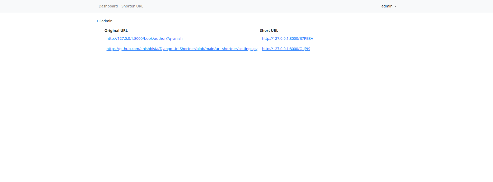

# Django URL Shortner
## Overview
Django URL Shortner is designed to shorten URLs effiecently. It provides convenient way to create shortned versions of long URLs


## Tech Stack

**Client:** HTML, CSS

**Server:** Django


## Features

- Shorten long URLs into manageable links.
- User authentication managing shortened URLs
- Simple user interface


## Installation

Clone the repository:
```bash
git clone https://github.com/anishbista/Django-Url-Shortner
```
Navigate to the project directory:
```bash
cd Django-Url-Shortner
```

Create a virtual environment

```bash
python -m venv myenv
source myenv/bin/activate 
```

Install required packages 

```bash
pip install -r requirements.txt

```
Apply migrations:
```bash
python manage.py migrate
```


Create SuperUser:
```bash
python manage.py createsuperuser
```

Run the development server:
```bash
python manage.py runserver
```
Access the application at `http://localhost:8000` in your web browser.
## URLs

- **Home:** `http://127.0.0.1:8000/` - Landing page and Dashboard of the application.
- **Shorten URL:** `http://127.0.0.1:8000/shorten/` - Endpoint for shortening URLs.

## Screenshots



## Support

For any inquiries or support, email anishbista9236@gmail.com 


